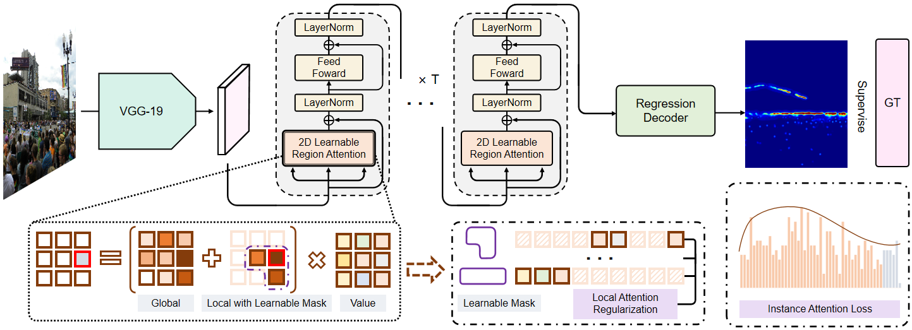

# Boosting-Crowd-Counting-via-Multifaceted-Attention
Official Implement of CVPR 2022 paper 'Boosting Crowd Counting via Multifaceted Attention'

[arxiv](https://arxiv.org/pdf/2203.02636.pdf) | [知乎](https://zhuanlan.zhihu.com/p/478023612) | [B站](https://www.bilibili.com/video/BV13Y411u7r5?share_source=copy_web)



## Train
1. Dowload Dataset JHU++ or UCF-QNRF.
2. Preprocess them by 'preprocess_dataset.py' or 'preprocess_dataset_ucf.py'.
3. Change the path to where your data and models are located in 'Train.py'.
4. Run 'Train.py'
5. Wait patiently and happily for the program to finish.
6. Then you will get a good counting model!


## Test
1. Dowload Dataset JHU++ or UCF-QNRF.
2. Preprocess them by 'preprocess_dataset.py' or 'preprocess_dataset_ucf.py'.
3. JHU Model [Link](https://drive.google.com/file/d/14piGsWRFy9BSXI1Jv9zRxypDxpOHbwCY/view?usp=sharing); UCF Model [Link](https://drive.google.com/file/d/1Y2WU0kIlZq3x28JZskvGx1cuZt0KQkXF/view?usp=sharing)
4. Change the path to where your data and models are located in 'Test.py'.
5. Run 'Test.py'.


## Citation
If you use this code for your research, please cite our paper:

```
@inproceedings{lin2022boosting,
  title={Boosting Crowd Counting via Multifaceted Attention},
  author={Lin, Hui and Ma, Zhiheng and Ji, Rongrong and Wang, Yaowei and Hong, Xiaopeng},
  booktitle={CVPR},
  year={2022}
}
```
